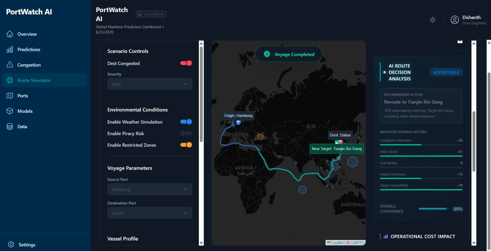
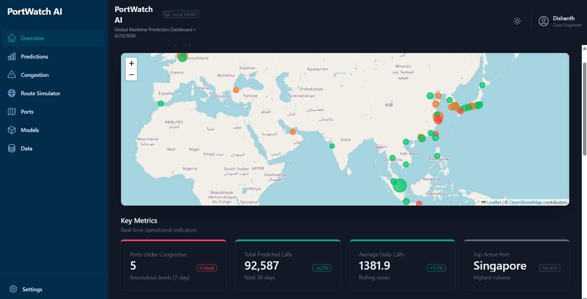
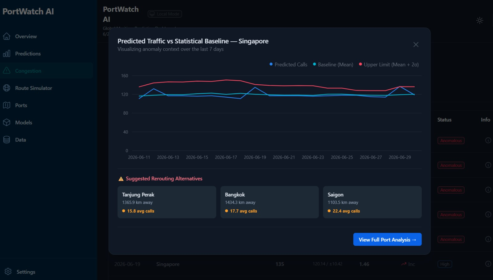
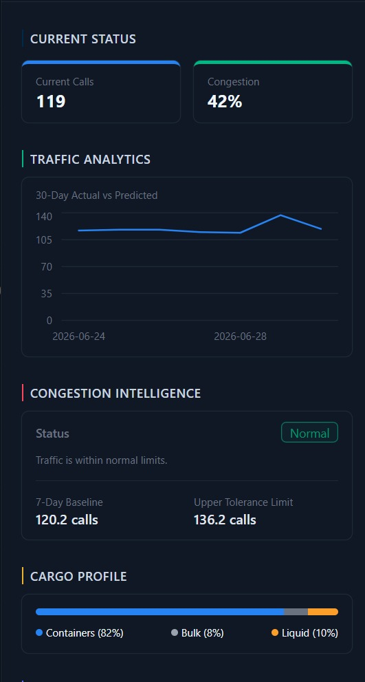

# 🚢 PortWatch AI

> AI-powered maritime traffic forecasting, congestion intelligence, and explainable vessel rerouting simulation.



PortWatch AI is a full-stack maritime intelligence platform that combines machine learning, anomaly detection, geospatial analytics, and operational route simulation to help predict port traffic, identify congestion risks, recommend alternative ports, and simulate vessel rerouting decisions.

Unlike traditional maritime dashboards that focus primarily on historical reporting, PortWatch AI provides predictive and prescriptive intelligence through forecasting, congestion analysis, and explainable operational decision support.

---

# ✨ Key Features

### 📈 Maritime Traffic Forecasting

* Traffic prediction using LightGBM and ARIMA
* Recursive multi-day forecasting
* Historical trend analysis
* Hybrid actual + forecast traffic simulation

### 🚨 Congestion Intelligence

* Dynamic anomaly detection
* Rolling statistical baselines
* Congestion severity scoring
* Congestion risk visualization

### 🌍 Interactive Maritime Dashboard

* Global maritime traffic visualization
* Port-level operational analytics
* Traffic monitoring and insights
* Interactive geospatial exploration

### 🚢 Intelligent Vessel Rerouting

* Alternative port recommendations
* Cargo compatibility analysis
* Vessel compatibility analysis
* Operational decision support

### 🧠 Explainable AI

* Route recommendation reasoning
* Decision confidence scoring
* Weighted scoring factors
* Operational impact analysis

### 🗺️ Route Simulation Engine

* Sea-lane based routing
* Dynamic rerouting scenarios
* Environmental risk simulation
* Voyage event timeline generation

---

# 📸 Platform Preview

## Global Maritime Intelligence Dashboard



Real-time visualization of global maritime traffic, port activity, congestion hotspots, and operational KPIs across major ports.

---

## Congestion Intelligence & Anomaly Detection



Traffic anomalies are detected using rolling statistical baselines and forecasting models. The system identifies congestion risks and recommends alternative ports for operational rerouting.

---

## Port Deep Dive Analytics



Detailed port-level intelligence including current traffic conditions, congestion status, historical trends, baseline thresholds, cargo profiles, and operational insights.

---

## Intelligent Vessel Route Simulator


Interactive route simulation environment capable of modeling vessel voyages, congestion events, environmental risks, and AI-driven rerouting recommendations.

---

# 🏗️ System Architecture

```text
Historical Maritime Dataset
            ↓
Data Processing Pipeline
            ↓
Feature Engineering
            ↓
LightGBM / ARIMA Models
            ↓
Hybrid Simulation Engine
            ↓
FastAPI Backend Services
            ↓
React Analytics Dashboard
            ↓
Operational Decision Support
```

---

# 🚀 Core Innovations

### Hybrid Recursive Forecasting Engine

Traditional forecasting systems generate static predictions.

PortWatch AI continuously updates future traffic estimates by recursively feeding predictions back into the forecasting pipeline, creating a realistic simulation of future maritime activity.

### Dynamic Congestion Intelligence

The platform uses rolling statistical baselines and anomaly detection to identify unusual traffic patterns and emerging congestion risks.

### Explainable Rerouting Decisions

Instead of providing a black-box recommendation, the platform explains why a particular rerouting decision was selected through weighted operational scoring.

### Maritime Corridor-Based Routing

Routes are generated using navigable maritime corridors and waypoints rather than direct point-to-point lines, improving route realism.

---

# 🤖 Machine Learning Pipeline

## Models Implemented

### LightGBM

Primary forecasting model used for port traffic prediction.

Features:

* Non-linear traffic modeling
* Fast inference
* Recursive forecasting support
* Scalable deployment

### ARIMA

Statistical baseline forecasting model used for comparison and validation.

---

# 🔧 Feature Engineering

The forecasting pipeline generates multiple temporal features:

### Lag Features

```text
lag_1
lag_7
lag_14
lag_30
```

### Rolling Statistics

```text
rolling_mean_7
rolling_std_7
```

### Calendar Features

```text
day_of_week
is_weekend
```

These features help capture seasonality, historical behavior, and local traffic trends.

---

# 🚨 Congestion Intelligence

The congestion engine evaluates traffic behavior using rolling statistical baselines.

### Baseline Traffic

```text
rolling_mean_7
```

### Dynamic Threshold

```text
upper_limit = mean + 2 × std
```

### Severity Scoring

```text
z = (value - mean) / std
```

Used to classify traffic conditions into:

* Normal
* Elevated
* Congested
* Anomalous

---

# 🚢 Route Simulation System

The route simulator serves as the operational decision-support layer of the platform.

## Voyage Inputs

### Source & Destination

* Origin Port
* Destination Port

### Vessel Profile

* Vessel Type
* Vessel Size

### Cargo Information

* Cargo Type
* Hazardous Cargo
* Perishable Cargo

### Operational Preferences

* Priority Level
* Delay Tolerance
* Routing Strategy

---

## Environmental Risk Simulation

Supported simulation factors include:

* Storm Zones
* High Wave Regions
* Piracy Risk Areas
* Restricted Maritime Zones

The routing engine can optimize for:

* Fastest Route
* Lowest Cost
* Safest Route
* Fuel Efficient Route

---

## AI Route Decision Analysis

The decision engine evaluates:

* Congestion Reduction
* Delay Savings
* Fuel Impact
* Hazard Avoidance
* Cargo Compatibility
* Vessel Compatibility
* Operational Risk

Outputs include:

* Recommended Action
* Confidence Score
* Decision Quality
* Route Justification

---

# 🛠️ Tech Stack

## Frontend

* React
* Vite
* Tailwind CSS
* Recharts
* Leaflet

## Backend

* FastAPI
* Python

## Machine Learning

* LightGBM
* ARIMA
* Pandas
* NumPy
* Scikit-Learn

## Data Processing

* Parquet Datasets
* Time-Series Feature Engineering

---

# 📂 Project Structure

```text
PortWatch-AI-2.0
│
├── backend/
│   ├── api/
│   ├── services/
│   └── main.py
│
├── notebooks/
│   ├── data/
│   ├── models/
│   └── outputs/
│
├── portwatch-frontend/
│
├── assets/
│   ├── dashboard-overview.png
│   ├── congestion-analysis.png
│   ├── port-analysis.png
│   └── route-simulator.png
│
└── README.md
```

---

# ⚙️ Installation

## Backend Setup

```bash
cd backend
pip install -r requirements.txt
python main.py
```

## Frontend Setup

```bash
cd portwatch-frontend
npm install
npm run dev
```

---

# 📈 Key Achievements

✅ End-to-end maritime intelligence platform

✅ Hybrid recursive forecasting engine

✅ Dynamic congestion analytics

✅ Explainable AI rerouting system

✅ Sea-lane-based route simulation

✅ Operational cost impact analysis

✅ Interactive geospatial visualization

✅ Fully local deployment architecture

---

# 🔮 Future Work

* Real AIS vessel integration
* Live maritime traffic feeds
* Multi-vessel fleet simulation
* Automated model retraining
* Smart port IoT integration
* Advanced berth allocation intelligence
* Reinforcement learning based routing

---

# 👨‍💻 Authors

**Dishanth A M**

RV College of Engineering, Bengaluru

---

# 📄 License

This project was developed for academic and research purposes.
For educational use, research exploration, and maritime analytics experimentation.
